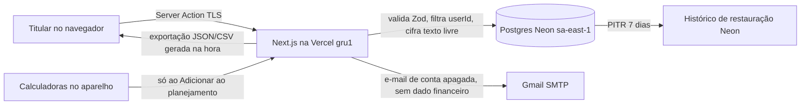

# RIPD — Lançamentos, fixos, limites, categorias próprias e calculadoras

**Atividades**: A010 (lançamentos, gráficos e projeção), A011 (calculadoras trabalhistas), A012 (limites por categoria), A013 (categorias próprias), A014 (fixos e rendas previstas)
**Slug**: ripd-lancamentos
**Controlador**: Miguel Angelo (pessoa natural; enquadramento como agente de tratamento de pequeno porte a confirmar — G02)
**Encarregado**: pendente de designação (G01); aprovação desta versão pelo controlador
**Equipe**: Miguel (produto, código e decisões); apoio do plugin `lgpd-skills` e revisão técnica automatizada
**Versão**: v1 | **Data**: 2026-09-30
**Metodologia**: estrutura do Art. 38 da LGPD; teste de alto risco da Res. CD/ANPD nº 2/2022, Art. 4º; análise de risco probabilidade × impacto (ISO 31000 / ISO 27005), escala 1 a 5.

> Registro técnico de apoio. Não é aconselhamento jurídico: a base legal do Art. 11 e o risco residual devem ser revistos por pessoa especialista em proteção de dados antes da abertura ao público.

---

## 1. Sumário executivo

A próxima etapa do Midas guarda a vida financeira da pessoa: o que entrou e saiu (lançamentos), o que se repete todo mês (fixos), limites por categoria, categorias criadas por ela e contas das calculadoras de férias, 13º, rescisão, salário líquido e seguro-desemprego, que viram rendas previstas no planejamento.

O tratamento é de alto risco pelo teste cumulativo da Res. CD/ANPD nº 2/2022, Art. 4º: dados financeiros confidenciais podem afetar significativamente interesses do titular (critério geral) e a categoria "Saúde" e o texto livre podem revelar dado referente à saúde (Art. 5º, II — critério específico de dado sensível). Não há larga escala hoje (projeto pessoal, código aberto), nem decisão automatizada que afete interesses (a projeção é estimativa mostrada só à própria pessoa — Art. 20 não se aplica).

**Resultado**: prosseguir com modificações. A base legal da parte sensível é o **Art. 11, II, "d"** (decisão do controlador em 2026-09-30), com salvaguardas técnicas que reduzem os riscos principais para nível baixo ou médio: criptografia do texto livre na aplicação, nada em logs, e-mails ou URLs, sem inferência nem perfil, acesso só pelo `userId` da sessão, exclusão em cascata e exportação em autosserviço. O risco residual aceito é que categoria, valor e data ficam em claro no banco.

## 2. Contexto

- **Produto/feature**: registro de rendas e gastos, gráficos por mês e categoria, projeção dos próximos meses, fixos (inclusive parcelas), limites por categoria com aviso a 90%, categorias próprias com ícone, e cinco calculadoras trabalhistas que criam rendas previstas.
- **Stakeholders**: titulares (pessoas usuárias adultas; público inclui quem tem pouca familiaridade com tecnologia e pessoas idosas), controlador, operadores (Vercel, Neon, Google para e-mail).
- **Volume estimado**: dezenas a poucos milhares de titulares no primeiro ano; muito abaixo do limiar preliminar de larga escala (~2 milhões).
- **Início previsto**: PR 3 do plano do núcleo do produto (após aprovação desta RIPD).

## 3. Descrição do tratamento

### 3.1 Fluxo de dados

- **Coleta**: digitado pela própria pessoa. As calculadoras calculam no aparelho; nada vai ao servidor até "Adicionar ao planejamento", quando o servidor recalcula a partir das respostas validadas e guarda o resultado cifrado.
- **Armazenamento**: tabelas `entry`, `recurring`, `category_limit`, `user_category`, `calculation`, `expected_income`, `user_preference` (todas com `userId` e `ON DELETE CASCADE`).
- **Uso**: exibir à própria pessoa (listas, somas, gráficos, projeção, avisos de limite). Sem uso secundário.
- **Compartilhamento**: nenhum. Operadores só hospedam e processam (Vercel, Neon). O e-mail (Google) nunca leva dado financeiro.
- **Eliminação**: pela pessoa (excluir lançamento, parar fixo, apagar conta de calculadora, apagar categoria, apagar a conta). Exclusão física, sem soft delete; cópias no PITR somem ao fim da janela de 7 dias (retention.md).

### 3.2 Sistemas envolvidos
- Frontend: Next.js 16 (React 19), servido pela Vercel; CSP restrita sem terceiros.
- Backend: Server Actions e renderização no servidor na Vercel (gru1).
- Banco: PostgreSQL no Neon (aws-sa-east-1), TLS `verify-full`, criptografia em repouso do provedor.
- Cache/filas: nenhum.
- Observabilidade: logs da plataforma com lista fechada de campos (`userId`, `route`, `status`, `code`, `durationMs`, `count`); sem valores, descrições ou buscas.

### 3.3 Operadores
- Vercel — `.lgpd/vendors/vercel.md`
- Neon — `.lgpd/vendors/neon.md` (revisão obrigatória antes de guardar lançamentos, `transfers/neon.md`)
- Google (Gmail SMTP) — `.lgpd/vendors/google-gmail.md` (só e-mail sem dado financeiro)

## 4. Necessidade e proporcionalidade

| Dado | Por que é necessário | O que não se coleta |
|---|---|---|
| Valor em centavos, tipo, data | Somar o mês, projetar | — |
| Categoria (id) | Gráficos por categoria, limites | Estabelecimento, CNPJ, local |
| Descrição (opcional, até 60 caracteres) | A pessoa reconhecer o lançamento | É opcional; sem descrição, mostra o nome da categoria |
| Fixos (valor, dia, meses) | Anotar sozinho no dia e projetar | Dados bancários, débito automático |
| Categoria própria (nome até 20, ícone) | Personalização pedida pela pessoa | Cor (não existe) |
| Calculadoras (salário, datas, tipo de saída, dependentes em número, saldo FGTS opcional) | Calcular a estimativa | Empregador, CPF, CTPS, PIS, nomes de dependentes |
| Rendas previstas (valor, data, tipo) | Entrar no planejamento | — |

- **Alternativas avaliadas**:
  - *Consentimento (Art. 11, I)*: rejeitado para a primeira versão. Exigiria caixa destacada antes de usar a categoria Saúde e, se revogado, impediria parte do serviço contratado; aumenta o atrito para o público-alvo sem reduzir o risco técnico.
  - *Remover a categoria Saúde*: rejeitado; a pessoa anotaria em "Outros" com descrição livre, o que não reduz o risco e piora a utilidade.
  - *Cifrar também categoria, valor e data*: adiado. Impede somas no banco; viável em memória para volumes por pessoa, mas a relação custo/benefício hoje não justifica. Reavaliar se a revisão jurídica pedir (R02).
  - *Guardar toda conta de calculadora automaticamente*: rejeitado (minimização); só guarda o que a pessoa adiciona ao planejamento.
- **Conclusão**: os dados são os mínimos para a finalidade declarada; o tratamento é proporcional ao risco com as salvaguardas da seção 9.

## 5. Princípios LGPD (Art. 6)

| Princípio | Como é atendido |
|---|---|
| I — Finalidade | Mostrar as finanças da própria pessoa; declarada na política e em "Seus dados". Nunca perfilar, pontuar, vender ou anunciar. |
| II — Adequação | A pessoa digita os dados para ver o próprio orçamento; uso idêntico à expectativa. |
| III — Necessidade | Tabela da seção 4; descrição opcional; calculadoras sem documentos; contas de calculadora só quando adicionadas ao planejamento. |
| IV — Livre acesso | "Seus dados" mostra contagens e permite baixar tudo (JSON completo e CSV) com a senha. |
| V — Qualidade | Todo lançamento, fixo, limite e categoria pode ser corrigido pela própria pessoa; validação no servidor (Zod). |
| VI — Transparência | Política em linguagem simples; "Seus dados" lista o que é guardado; resultados de calculadora e projeção sempre como estimativa, com a fonte das tabelas. |
| VII — Segurança | Seção 9: criptografia de texto livre, TLS, autorização por `userId`, CSP, limites de escrita, reautenticação para exportar e apagar. |
| VIII — Prevenção | Esta RIPD; agente `security-reviewer` em todo PR de dados; testes de isolamento entre contas e de cobertura de exclusão e exportação. |
| IX — Não discriminação | Não há decisão automatizada, pontuação nem IA. A projeção é média simples explicada na tela. |
| X — Responsabilização | Registros versionados em `.lgpd/`; revisão em PR; eventos de segurança (exportação registrada como `DATA_EXPORTED`). |

## 6. Base legal

- **Parte comum** (valor, tipo, data, categorias não sensíveis, fixos, limites, calculadoras, rendas previstas): **Art. 7º, V** — execução de contrato; é a funcionalidade que a pessoa pede ao usar o app.
- **Parte possivelmente sensível** (lançamentos, fixos, limites e categorias próprias que revelem saúde — categoria Saúde, descrições como "farmácia", ícones como "remédio"): **Art. 11, II, "d"** — tratamento indispensável ao exercício regular de direitos, inclusive em contrato. Decisão do controlador em 2026-09-30.
  - **Por que é indispensável**: o serviço contratado é registrar e mostrar os gastos da própria pessoa. Se ela escolhe anotar um gasto de saúde, guardá-lo e mostrá-lo a ela é a própria execução do contrato; não há como prestar o serviço sem tratar o que ela digitou.
  - **Limites da base**: vale só para essa finalidade. Qualquer uso além de mostrar à própria pessoa (estatística, pesquisa, produto novo) exige nova avaliação e provavelmente consentimento (Art. 11, I) ou anonimização.
  - **Ponto de atenção jurídico**: a leitura de "exercício regular de direitos, inclusive em contrato" como base para execução contratual com dado sensível é defendida por parte da doutrina, mas não há orientação específica da ANPD. Registrar revisão por especialista (G21).
- **Direitos do titular** (A009): Art. 7º, II.
- **LIA**: não se aplica (não há legítimo interesse nestas atividades).

## 7. Direitos do titular

| Direito (Art. 18) | Como é exercido |
|---|---|
| I — Confirmação de existência | "Seus dados" › "O que o Midas guarda", com contagens ("312 lançamentos desde março de 2026") |
| II — Acesso | "Baixar meus dados": JSON completo e CSV de lançamentos, gerados na hora, após reautenticação |
| III — Correção | Tocar no lançamento, fixo, limite ou categoria e editar |
| IV — Anonimização, bloqueio ou eliminação de desnecessários | Excluir o item; apagar conta de calculadora; nada é guardado sem ação da pessoa |
| V — Portabilidade | JSON (completo, chaves em pt-BR) e CSV (`;`, BOM, abre no Excel pt-BR) |
| VI — Eliminação | "Apagar minha conta": exclusão física imediata em cascata; cópias de restauração somem em até 7 dias |
| VII — Informação sobre compartilhamento | Política de privacidade lista operadores; não há compartilhamento com terceiros |
| VIII — Informação sobre não consentir | N/A: a base não é consentimento; a política explica a base e que a descrição é opcional |
| IX — Revogação do consentimento | N/A pelo mesmo motivo |
| Art. 20 — Revisão de decisão automatizada | N/A: a projeção é estimativa informativa, sem efeito sobre direitos |

Prazo do Art. 19, II (15 dias) atendido por autosserviço imediato.

## 8. Identificação de riscos

| ID | Risco | P | I | Nível | Status |
|---|---|---|---|---|---|
| R01 | Acesso de uma conta aos dados de outra (IDOR, id vindo do cliente) | 3 | 5 | 15 (alto) | mitigado → 5 |
| R02 | Vazamento do banco (credencial, branch de preview, backup, incidente no provedor) expondo descrições e padrões de gasto | 2 | 5 | 10 (alto) | mitigado → 6 (residual aceito) |
| R03 | Dado financeiro ou de saúde em logs, mensagens de erro, e-mails ou URLs | 3 | 4 | 12 (alto) | mitigado → 3 |
| R04 | Inferência ou perfil de saúde a partir dos lançamentos (uso secundário) | 1 | 5 | 5 (médio) | mitigado → 2 |
| R05 | Exclusão incompleta (tabela nova fora da cascata) ou volta de dado apagado após restauração | 2 | 4 | 8 (médio) | mitigado → 3 |
| R06 | Exportação incompleta ou arquivo CSV com fórmula maliciosa (injeção) | 2 | 3 | 6 (médio) | mitigado → 2 |
| R07 | Tomada de conta leva a exportação ou exclusão dos dados | 2 | 5 | 10 (alto) | mitigado → 4 |
| R08 | Perda da chave de cifra torna descrições ilegíveis (integridade/disponibilidade) | 2 | 3 | 6 (médio) | mitigado → 3 |
| R09 | Estimativa de calculadora errada leva a decisão financeira ruim | 3 | 3 | 9 (médio) | mitigado → 4 |
| R10 | Abuso de escrita (volume) degrada o serviço para todos | 2 | 2 | 4 (baixo) | mitigado → 2 |
| R11 | Pessoa vê dado de outra num aparelho compartilhado (ombro, tela aberta) | 3 | 3 | 9 (médio) | mitigado → 6 (modo "Ocultar valores", sessão) |
| R12 | Transferência internacional via operadores dos EUA sem cláusulas confirmadas | 3 | 3 | 9 (médio) | pendente (G08, `transfers/neon.md`) |

## 9. Salvaguardas e mitigações

**Técnicas**
- **Autorização em toda consulta** (R01): todo acesso passa por `src/lib/data/*` com `userId` da sessão; mudanças com `updateMany`/`deleteMany({ where: { id, userId } })` e conferência de `count`; ids e categorias vindos do cliente validados quanto à dona; criação idempotente com `INSERT … ON CONFLICT DO NOTHING` + leitura por `id` e `userId` (nunca `upsert` por id). Testes de integração de isolamento entre contas.
- **Criptografia do texto livre na aplicação** (R02): AES-256-GCM (`node:crypto`), IV aleatório, dado associado (AAD) amarrando cada cifra a tabela, coluna, pessoa e linha; chaves versionadas por ambiente (`DATA_ENCRYPTION_KEYS`), rotação por script. Cobre: descrição de lançamentos e fixos, nome e ícone de categorias próprias, respostas e resultado das calculadoras. Soma-se à criptografia em repouso do Neon e ao TLS `verify-full`. Detalhes em `.lgpd/encryption.md`.
- **Nada fora do banco** (R03): logger com lista fechada de campos; mensagens de erro genéricas; busca por descrição feita no navegador; respostas de calculadora só na memória da página; URLs levam só mês, passo e ids aleatórios; e-mails nunca levam valor, categoria ou descrição.
- **Sem uso secundário** (R04): nenhum analytics, pixel ou IA; nenhuma consulta agregada entre pessoas; categorias não geram perfil.
- **Cobertura de exclusão e exportação** (R05, R06): teste automático falha se uma tabela com `userId` não estiver na exportação ou se uma chave estrangeira para `user` não tiver `ON DELETE CASCADE`; registro de contas apagadas (`deleted_account`, só o id) para reaplicar exclusões após restauração; CSV com neutralização de fórmulas.
- **Reautenticação e limites** (R07, R10): exportar e apagar pedem a senha, com limite por conta (`pwcheck`); limite de escrita por pessoa; tetos (30 categorias, 100 fixos); valores limitados a int4 com `CHECK` no banco.
- **Chaves** (R08): backup offline das chaves; chave atual e anteriores aceitas na leitura; falha de decifração mostra o nome da categoria em vez de erro.
- **Calculadoras** (R09): tabelas oficiais versionadas por vigência com fonte citada; testes com exemplos oficiais; resultado sempre "cerca de", com "É uma estimativa. Confira os valores com o RH ou o sindicato." e o ano da tabela.
- **Tela compartilhada** (R11): modo "Ocultar valores" guardado só no aparelho; "Sair de todos os aparelhos".

**Administrativas e organizacionais**
- Revisão de todo PR que toca dados pelo agente `security-reviewer` e pelo controlador.
- Registros `.lgpd/` atualizados no mesmo PR que muda o tratamento.
- Plano de incidente (G05) antes da abertura ao público.

## 10. Risco residual

- **Categoria, valor e data ficam em claro no banco** (R02). Quem obtiver cópia do banco e das credenciais vê quanto cada conta gasta em cada categoria (inclusive "Saúde"), mas não as descrições, nomes de categorias próprias nem contas de calculadora. Com e-mail em claro na tabela `user`, a ligação à pessoa é possível. **Aceito** para a primeira versão: probabilidade baixa (Neon em sa-east-1 com TLS, sem acesso público, previews em branch vazio — G19), e a alternativa (cifrar tudo) impede somas no banco. Reavaliar na próxima revisão ou por orientação jurídica.
- **Transferência internacional** (R12) depende das cláusulas dos operadores (G08) — não bloqueia esta RIPD, mas bloqueia a abertura ao público.
- Demais riscos ficam baixos ou médios após as salvaguardas e são **aceitáveis**.

## 11. Consulta a partes interessadas

- Equipe técnica: plano revisado por agente de arquitetura e pelo controlador (2026-09-30).
- Segurança: revisão pelo agente `security-reviewer` em cada PR de dados.
- Encarregado: pendente de designação (G01).
- Jurídico: **pendente** — revisar a escolha do Art. 11, II, "d" e o risco residual (G21).
- Titulares: não consultados (projeto pré-lançamento); recomendável teste de usabilidade da tela "Seus dados".

## 12. Decisão

- [ ] Prosseguir como planejado
- [x] Prosseguir com modificações: implementar todas as salvaguardas da seção 9 antes de guardar dados reais; revisão jurídica do Art. 11 (G21) e cláusulas dos operadores (G08) antes da abertura ao público
- [ ] Não prosseguir
- [ ] Consultar ANPD previamente (Art. 38, parágrafo único)

**Aprovado por**: ⏸ pendente — Miguel (controlador), no merge do PR que traz esta RIPD
**Data**: —

## 13. Plano de revisão

- Próxima revisão: 2027-03-30, ou antes se: novo campo ou tabela com dado pessoal; uso de IA, estatística ou compartilhamento; integração com bancos ou WhatsApp; mudança de operador ou região; incidente; orientação da ANPD sobre o Art. 11.
